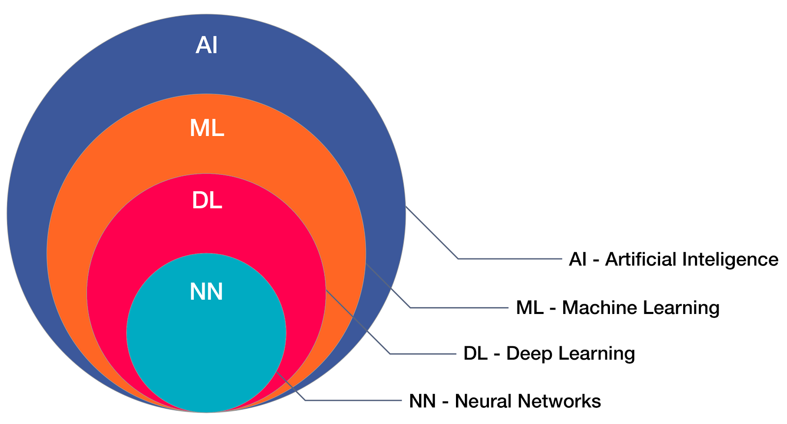

# Machine Leanring

---

### AI vs ML vs DL vs NN

### A Roadmap for you

[Machine Learning Roadmap 2020](https://whimsical.com/machine-learning-roadmap-2020-CA7f3ykvXpnJ9Az32vYXva)

***Overwhelmed?***

Let's break down stuff.

---

# Python

Note- ML is extensively done in another languages like R,Octave,Matlab and many more.However they might not be the ***most user friendly/practical*** in starting phase of your ML journey.

## Basics

[freeCodeCamp.org](https://www.freecodecamp.org/learn/scientific-computing-with-python/python-for-everybody/)

Focus on data structures and data visualization.

## Numpy,Pandas and Data Analysis

[freeCodeCamp.org](https://www.freecodecamp.org/learn/data-analysis-with-python/data-analysis-with-python-course/)

[freeCodeCamp.org](https://www.freecodecamp.org/learn/data-analysis-with-python/numpy/)

---

# Introductory Machine Learning

## Theory heavy course(s)

## 1. Learning from Data by Prof Abu-Mostafa

[Learning From Data - Online Course (MOOC)](https://work.caltech.edu/telecourse)

Very nice theoretical treatment of the subject

## 2. Machine Learning by Andrew Ng

[Machine Learning](https://www.coursera.org/learn/machine-learning)

Has working exercises,uses Octave though,very good for learning theory

## More Hands-On course(s)

## 1. ML Crash Course by Google using TensorFlow

[机器学习速成课程 | Google Developers](https://developers.google.cn/machine-learning/crash-course/)

## 2. Udemy A-Z ML Course

[Machine Learning A-Z (Python & R in Data Science Course)](https://www.udemy.com/course/machinelearning/)

## Recommended Text(s)

### 1. Hands-On Machine Learning with Scikit-Learn and TensorFlow

[https://s3-us-west-2.amazonaws.com/secure.notion-static.com/a5671b7d-5d4c-48d7-a8d5-624cc41de355/Hands_On_Machine_Learning_with_Scikit_Learn_and_TensorFlow.pdf](https://s3-us-west-2.amazonaws.com/secure.notion-static.com/a5671b7d-5d4c-48d7-a8d5-624cc41de355/Hands_On_Machine_Learning_with_Scikit_Learn_and_TensorFlow.pdf)

Author takes a very practical approach for developing ML concepts with code snippets alongside.Heavily recommended if you more of book type/use it as a general reference.

### 2. Pattern Recognition and Machine Learning by Bishop

[https://s3-us-west-2.amazonaws.com/secure.notion-static.com/736be5cc-3d1c-4f79-94e3-dbc2c497188a/Springer_ML.pdf](https://s3-us-west-2.amazonaws.com/secure.notion-static.com/736be5cc-3d1c-4f79-94e3-dbc2c497188a/Springer_ML.pdf)

One of the holy grails of ML Literature.Very theoretical,mathematical and lucid explanation of ML algorithms.*Requires some previous experience with Linear Algebra though*.Use for your conceptual understanding.

---

# Deep Learning

Above resources also contains Deep Learning concepts,but here we delve ***deeper.***

## Course(s)

## Deep Learning Specialization

[Deep Learning](https://www.coursera.org/specializations/deep-learning)

If you finally decide to get hands dirty with Deep Learning!

## Text(s)

## Deep Learning by Goodfellow

[Deep Learning](https://www.deeplearningbook.org/)

Classic DL text

---

# Miscellaneous

## Kaggle

[Kaggle: Your Machine Learning and Data Science Community](https://www.kaggle.com/)

As soon as you start getting comfortable with reading/developing ML models,heavily recommended to join Kaggle.Start participating in online competitions(some have cash prizes!) and ***more importantly read and implement notebooks of other people***,will heavily increase your knowledge.

## UCI Repo

[UCI Repo Link](https://archive.ics.uci.edu/ml/index.php)

Great repo of data sets.
Kaggle is another good source for datasets.

## Blogs

# Deep Learning Demystified

[https://deeplearningdemystified.com/](https://deeplearningdemystified.com/)

Blog explaining DL concepts aided with visualisations and charts. ( very easy to understand and follow)

## 1. Machine Learning Mastery

[How to Get Started With Recommender Systems - Machine Learning Mastery](https://machinelearningmastery.com/blog/)

Great blog with ML concepts explained in more hands-on fashion.

## 2. I am Trask

[i am trask](http://iamtrask.github.io/)

## 3. Machine-Learning-Tutorials

[ujjwalkarn/Machine-Learning-Tutorials](https://github.com/ujjwalkarn/Machine-Learning-Tutorials)

---
